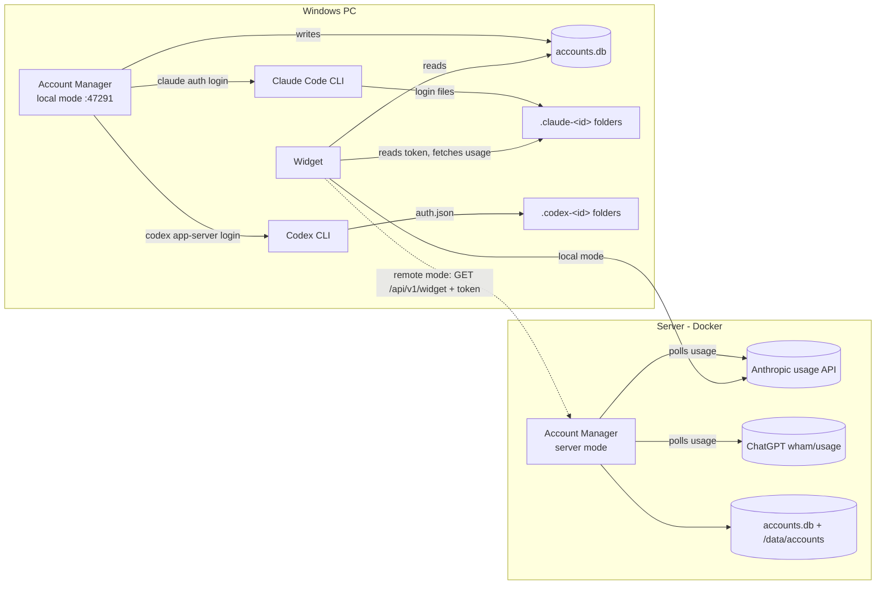

# Project overview

A fork of [CodeZeno/Claude-Code-Usage-Monitor](https://github.com/CodeZeno/Claude-Code-Usage-Monitor)
(a Windows widget for Claude Code usage) that adds multi-account management, for Claude accounts
and OpenAI **Codex** (ChatGPT sign-in) accounts side by side.

## The three pieces

1. **Widget** (`src/`, Rust, Windows) — a small card on the desktop: per account, a 5-hour and a
   weekly bar with reset countdown; turns red at 90%, shows "Expired · re-login" when a login
   lapses. It reads its account list from `accounts.db` (reloading within ~5 s of any change), or
   from a server in **remote mode**.
2. **Account Manager** (`web/`, SvelteKit + Node's built-in `node:sqlite`) — the page where you add,
   rename, reorder, enable, re-login and remove accounts, plus a **Usage** page. Runs in two modes:
   - **local** (`http://127.0.0.1:47291`, starts with Windows): logs accounts in through the
     Claude Code CLI or the Codex CLI on this PC and writes the widget's card theme and settings.
   - **server** (Docker, `ACCTMGR_MODE=server`): the server holds the logins, polls usage itself,
     and needs a username + password; widgets read it with API tokens.
3. **Kit** (`setup.ps1`, `install.ps1`, `kit/`, `justfile`) — install, start-with-Windows,
   shortcuts, updates, and every day-to-day command.

## How data flows

## Design contract

Database schema, the widget's DB rules, server responsibilities, `GET /api/v1/widget` and remote
mode are specified in [`docs/account-manager-contract.md`](../../docs/account-manager-contract.md).
Change the contract first, then both sides.

## Deliberate limits

- Logins always go through the official Claude Code CLI or Codex CLI; nothing here calls Anthropic's
  or OpenAI's OAuth endpoints directly. Usage comes from the same endpoints the widget uses.
- Codex sign-in runs through `codex app-server` (the CLI's own login server on `localhost:1455`).
  Plain `codex login` is not used: on Windows it ignores `BROWSER` and opens the default browser,
  which may already be signed in to someone else's ChatGPT.
- `%USERPROFILE%\.claude` and `%USERPROFILE%\.codex` (your own installs) are never used or deleted.
- One Claude login per config folder; a login made on one server is independent of another.
