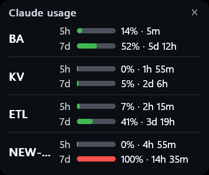
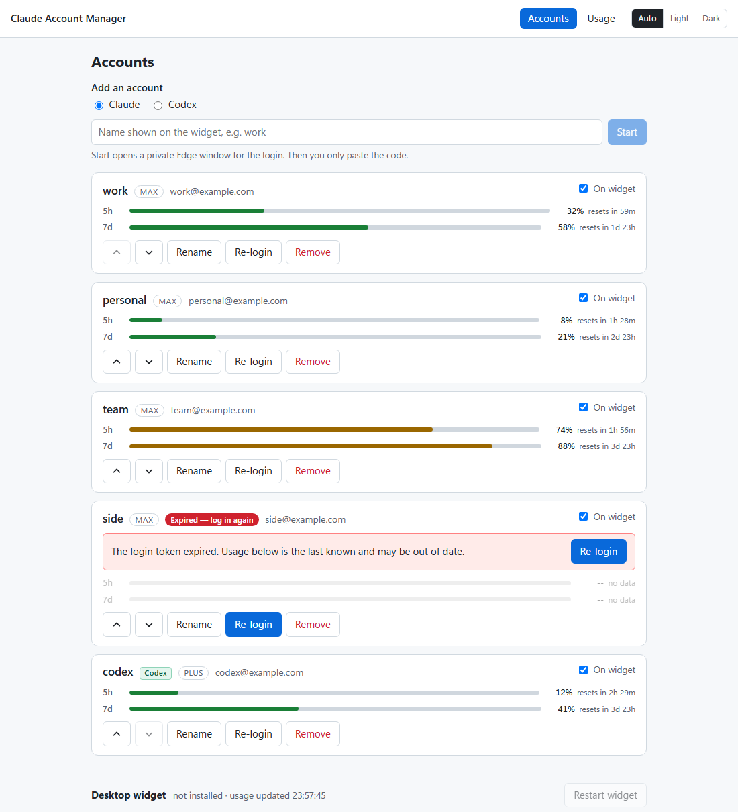
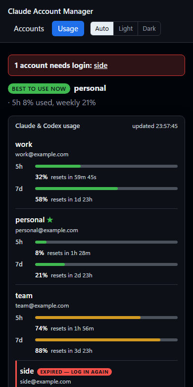
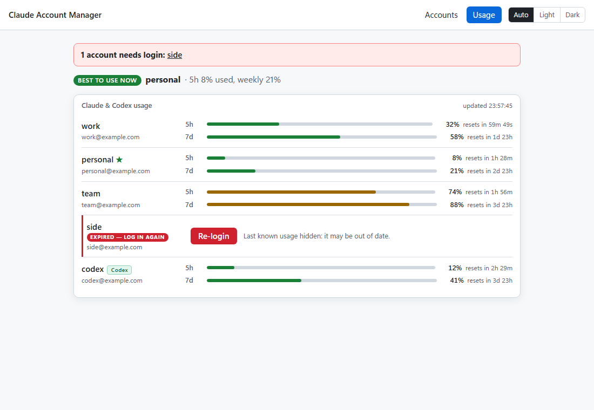
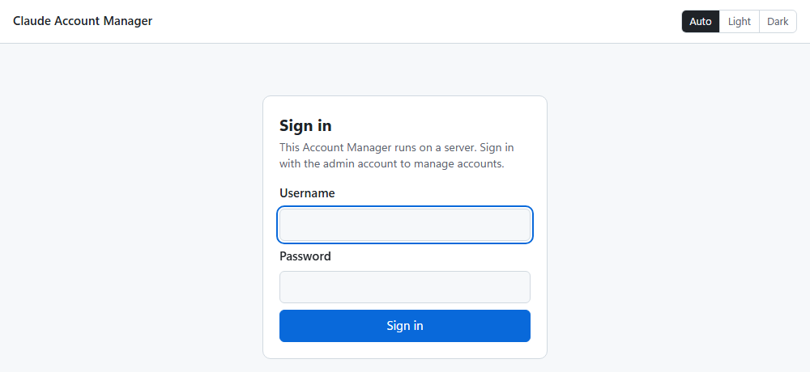

# Claude Code Usage Monitor (multi-account)

**Setup guide: <https://dxiiren.github.io/Claude-Code-Usage-Monitor/>**

> **Built on [Claude Code Usage Monitor](https://github.com/CodeZeno/Claude-Code-Usage-Monitor)
> by [Code Zeno](https://github.com/CodeZeno) (Craig Constable and contributors).** The desktop
> widget — its renderer, themes, providers, updater and Theme Studio — is their work; this fork
> adds multi-account management on top. See [Credits](#credits).

See the 5-hour and weekly usage of every Claude and OpenAI Codex (ChatGPT) account you own in one
place: a Windows desktop widget, a web **Account Manager** where adding an account is "type a name,
sign in, paste the code", and an optional Docker server that holds the logins so any PC's widget —
or a phone's browser — can follow the same accounts. Logins always go through the official Claude
Code CLI or Codex CLI, and everything is stored in SQLite (`accounts.db`) on the PC and on the
server alike.


> **New developer? Start with [`.docs/tldr.md`](.docs/tldr.md)** — every doc summarised on one
> page. The full guide lives in [`.docs/`](.docs/README.md). The upstream widget guide is kept
> in [`docs/upstream-README.md`](docs/upstream-README.md).

## Screenshots

| Desktop widget | Accounts page | On a phone |
| --- | --- | --- |
|  |  |  |
| **Usage page, light mode** | **Server sign-in** | |
|  |  | |

<!--
Re-shoot the four web-page images (usage-dark, usage-light, accounts-light, usage-mobile):
  cd web && npm run build && node scripts/demo-screenshots.mjs
It runs the built app on 127.0.0.1:47591 against a throwaway profile with the fake Claude and Codex
CLIs, four @example.com Claude demo accounts (one expired) and one Codex account - real accounts are
never touched. Port 1455 must be free (the fake Codex CLI's callback server).
widget-card.png is a capture of the real widget; server-login-light.png is the sign-in page of
`just docker-run` (http://127.0.0.1:47391). Never commit real hostnames, IPs or emails here.
-->

## What it shows

- **Claude and Codex side by side** — Claude Code accounts and OpenAI Codex (ChatGPT sign-in)
  accounts share one list, one Usage page and one widget card; Codex rows carry a small **Codex**
  tag.
- **Two bars per account** — the 5-hour session and the weekly window, each with the percent used
  and a countdown to its reset. The widget card colours a bar amber from 70% and red from 90%.
- **Which account to use now** — the Usage page tags the account with the lowest 5-hour use among
  those with room left in both windows; when every account is blocked, it says when the first one
  frees up.
- **Logins that lapse, said plainly** — an account whose login expired is flagged **Expired — log in
  again** on the widget and the pages, its stale numbers are hidden rather than shown as current,
  and **Re-login** is one click. Network errors alone never ask you to log in again.
- **Adding an account** — type a name → **Start** → a fresh, cookie-free Edge window opens the
  Claude sign-in (so your usual browser session cannot sign the wrong account in) → **Authorize** →
  paste the code → **Connect**. The page shows which email got connected and warns if two accounts
  share one. The widget picks the change up within about 5 seconds. Codex accounts sign in a little
  differently — see [Adding a Codex account](#adding-a-codex-account).
- **Light and dark** — an Auto / Light / Dark switch on every page (Auto follows the system).
- **Starts with Windows** — the widget and the local Account Manager, plus **Claude Usage** and
  **Claude Accounts** shortcuts (`just startup-off` to opt out).

What it deliberately does not do: nothing here calls Anthropic's or OpenAI's OAuth endpoints
itself — the Claude Code CLI and the Codex CLI do every login — and usage comes from the same
endpoints the upstream widget reads. Numbers are only as fresh as the poll interval, and polling
faster than the settings below risks those endpoints' rate limits:

| Where | Setting | Recommended |
| --- | --- | --- |
| Server | `ACCTMGR_POLL_SECONDS` in `deploy/.env` (default 300, minimum 30; backs off on 429) | 120 |
| PC widget | `just widget-poll <minutes>` (default 15) | 5 |
| Web pages | refresh themselves | every 15 s |

### Adding a Codex account

Pick **Codex** above the name box, then **Start**. The login runs through the official Codex CLI
(its `codex app-server` login, which waits for the sign-in on `localhost:1455`):

- **On a PC (local mode)** — a fresh, cookie-free Edge window opens the ChatGPT sign-in. Sign in and
  the page finishes by itself; there is no code to paste. If the window never opens or gets stuck,
  open **Edge window didn't open, or the sign-in is stuck?** and use the paste step described next.
- **On a server** — the page gives you a sign-in link for your own browser (a private window is
  safest). After you sign in, the browser lands on a `http://localhost:1455/auth/callback?...` page
  that **fails to load** — that is expected. Copy that whole address from the address bar, paste it
  into the page and click **Connect**; the server hands it to the Codex CLI waiting inside the
  container.

Only one Codex sign-in can wait at a time (the CLI has a single callback port), so add Codex
accounts one after another. Each account gets its own folder (`%USERPROFILE%\.codex-<id>` on a
PC, `/data/accounts/<id>` on a server); your own `~/.codex` is never used, changed or deleted.
On a server, Codex usage is polled by the server itself, like Claude's.

---

## Pick a setup path

| Path | When to use it | Time |
| --- | --- | --- |
| **A) One PC, one line** | You just want the widget + Account Manager on this PC; no Git needed | ~5 min |
| **B) Clone + `setup.ps1`** | You develop on this repo, or want the recipes and tests | ~10 min |
| **C) Docker server** | One place holds the logins for several PCs or a phone | ~15 min |
| **D) A PC widget following a server** | The server from C exists; this PC should show its accounts | ~2 min |

A and B end at the Account Manager on **<http://127.0.0.1:47291>** with the widget on the desktop.
C ends at a sign-in page on your own address (e.g. `https://claude.example.com`).

### Path A — One PC, one line

In PowerShell:

```powershell
irm https://raw.githubusercontent.com/dxiiren/Claude-Code-Usage-Monitor/main/install.ps1 | iex
```

It downloads the kit as a zip to `%USERPROFILE%\claude-usage-monitor` and runs `setup.ps1`, which
installs whatever is missing (Claude Code CLI, Node.js 22.13+, Codex CLI, just), fetches the
widget release (SHA-256 checked), builds the Account Manager and registers both to start with
Windows. Then open **Claude Accounts** (or <http://127.0.0.1:47291>) and add your accounts.
Re-running the line updates the kit; your accounts in `%APPDATA%\ClaudeCodeUsageMonitor\accounts.db`
are never touched.

### Path B — Clone + `setup.ps1`

For developers — follow [Quick start](#quick-start) below. `setup.ps1` takes `-WidgetFromSource`
(build the widget with cargo), `-NoStartup` and `-NoShortcuts`.

### Path C — Docker server

The same Account Manager in **server mode**: the server owns the Claude logins, polls every
account's usage itself, and asks for a username and password. On the Docker host:

```bash
git clone https://github.com/dxiiren/Claude-Code-Usage-Monitor ~/claude-usage
cd ~/claude-usage/deploy
cp .env.example .env && chmod 600 .env
# edit .env: ACCTMGR_ADMIN_USER, ACCTMGR_ADMIN_PASSWORD, ACCTMGR_PUBLIC_ORIGIN, ACCTMGR_POLL_SECONDS=120
docker compose up -d --build
curl -s http://127.0.0.1:47291/healthz   # -> ok
```

Then pick how people reach it (full settings in [`deploy/README.md`](deploy/README.md)):

| Setup | Add to `.env` | Notes |
| --- | --- | --- |
| **Cloudflare tunnel** (public) | `COMPOSE_FILE=docker-compose.yml:docker-compose.tunnel.yml`, `ACCTMGR_NETWORK`, `ACCTMGR_TRUST_PROXY=1`, `ACCTMGR_PUBLIC_ORIGIN=https://claude.example.com` | Route the tunnel's hostname to `http://claude-usage:47291`. HTTPS by Cloudflare. |
| **Own certificate** (LAN HTTPS) | `COMPOSE_FILE=docker-compose.yml:docker-compose.tls.yml`, `ACCTMGR_TLS_CERT`, `ACCTMGR_TLS_KEY`, `ACCTMGR_TLS_PUBLISH=0.0.0.0:<port>`, `ACCTMGR_TRUST_PROXY=1`, `ACCTMGR_PUBLIC_ORIGIN=https://<host>:<port>` | nginx sidecar; `http://` on that port redirects to `https://`. PCs must trust the certificate. |
| **Plain HTTP** (LAN only) | `ACCTMGR_PUBLISH=0.0.0.0:<port>`, `ACCTMGR_PUBLIC_ORIGIN=http://<host>:<port>` | The password travels unencrypted — prefer one of the above. |

Sign in, and add accounts the same way as on a PC: the server runs the Claude Code CLI (or, for
Codex accounts, the Codex CLI) inside the container and gives you an **Open sign-in page** link to
open in a private window of your own browser. The image carries both CLIs, pinned by
`CLAUDE_CODE_VERSION` and `CODEX_VERSION`. Security, briefly:

- The container refuses to start without `ACCTMGR_ADMIN_PASSWORD`; use a long one on anything
  internet-facing.
- Sign-in is rate limited: 5 failures per 15 minutes per client, plus a global cap. Failed attempts
  are logged with address and time, never what was typed.
- Sessions and widget tokens are stored as SHA-256 hashes only; tokens and Claude / Codex
  credentials are never returned by any endpoint or written to logs.
- The app answers exactly one origin, `ACCTMGR_PUBLIC_ORIGIN` — other host names and bare IPs get
  `403 Forbidden host`.
- Everything lives in the `claude-usage-data` volume; back it up to keep the logins.

### Path D — A PC widget following a server

On the server's **Widget tokens** page create a token (it is shown once), then on the PC:

```powershell
just remote https://claude.example.com <token>
```

The widget now reads the server's accounts (`GET /api/v1/widget`) instead of this PC's.
`just remote-off` switches back; **Revoke** on the server stops a token at once. Without a clone,
put `remote_server_url` and `remote_server_token` in
`%APPDATA%\ClaudeCodeUsageMonitor\settings.json` instead.

---

## Prerequisites

| Tool | Version | Installed by |
| --- | --- | --- |
| PowerShell + winget | Windows 10/11 stock | — (the only true prerequisites) |
| Claude Code CLI | latest | `setup.ps1` (the Account Manager logs accounts in through it) |
| Node.js | 22.13+ (uses `node:sqlite`) | `setup.ps1` |
| Codex CLI | latest | `setup.ps1` (`npm install -g @openai/codex`) — only needed for Codex accounts, so a failed install is a warning; the Docker image already has it |
| just | any recent | `setup.ps1` |
| Rust + MSVC build tools | 1.95 (`rust-toolchain.toml`) | manual — only to build the widget from source |
| Docker | 24+ with compose v2 | manual — only on a server |

## Quick start

```powershell
# 1. One-time machine setup (idempotent — safe to re-run)
git clone https://github.com/dxiiren/Claude-Code-Usage-Monitor
cd Claude-Code-Usage-Monitor
powershell -ExecutionPolicy Bypass -File ./setup.ps1

# 2. Close and reopen PowerShell so PATH updates land

# 3. Add your accounts: type a name, sign in in the fresh window, paste the code
#    (Codex: pick "Codex" first; on a PC the sign-in finishes by itself)
just web
```

The Account Manager is now at **<http://127.0.0.1:47291>** (usage page: `/usage`) and the widget
card is on the desktop. Both start with Windows; stop them with `just manager-stop` / `just stop`.

## Commands

Run `just` with no arguments to list every recipe. The ones you'll use daily:

| Command | What it does |
| --- | --- |
| `just web` | Open the Account Manager (starts it if needed) |
| `just usage` | Open the usage page |
| `just start` / `just stop` / `just restart` | Show, close or restart the widget |
| `just widget-poll 5` | Fetch usage every 5 minutes (default 15) |
| `just remote <url> <token>` | Make the widget follow a server's accounts (`just remote-off` to undo) |
| `just startup-on` / `just startup-off` | Widget + Account Manager start with Windows (or not) |
| `just widget-update` | Install the latest widget release (checksum-verified) |
| `just manager-build` | Rebuild the Account Manager after changing `web/`, then restart it |
| `just test` | Every suite: Rust, web unit, web e2e (local + server mode) |
| `just docker-build` / `just docker-run` | Build the server image / try it locally on :47391 |
| `just guide` | Open the setup guide website |
| `just claudex` | Launch Claude Code (Sonnet, all permissions) |
| `just claudel` | Launch Claude Code on the self-hosted model (needs `claude-local`: `/setup-claude-local`) |

Every recipe is in [`.docs/05-reference/commands.md`](.docs/05-reference/commands.md).

## Troubleshooting

### "The Claude Code login already stopped: Login successful"

Fixed in the current kit (the page used a sign-in link that finished the login behind its back).
Update with `git pull` then `just manager-build`, and **Re-login** that account.

### An account shows the same email as another

The browser was already signed in to another account. Click **Re-login** on the wrong one; the
sign-in window is always a fresh, cookie-free Edge profile.

### An account shows "Expired — log in again"

The widget or server got a 401/403, or an expired token it could not renew. Click **Re-login**.

### Codex: "The Codex CLI (codex) was not found on PATH"

`setup.ps1` could not install it (it warns and carries on). Install it with
`npm install -g @openai/codex`, reopen PowerShell, then `just manager-stop` and `just manager-start`
(or re-run `setup.ps1`). Claude accounts do not need it.

### Codex: the sign-in never finishes, or port 1455 is busy

Only one Codex sign-in can wait at a time: the Codex CLI's callback server uses port 1455, and
starting a new Codex login cancels the one still waiting. A `codex login` you started yourself in a
terminal holds the same port — close it, then **Re-login**.

### Codex: "Paste the full address from the browser, starting with `http://localhost:1455/auth/callback?`"

Only the address the browser landed on after signing in is accepted: host `localhost` (or
`127.0.0.1`), port 1455, path `/auth/callback`, with its `code` and `state`. Copy the whole address
bar of that failed page, not the sign-in link. An address from an earlier attempt belongs to a
different sign-in and is rejected — use the current link and paste the new address.

### `just widget-update` says "SHA-256 mismatch"

Update the kit (`git pull`): older kits could not hash under Windows PowerShell 5.1 started by `just`
from PowerShell 7 and reported that as a mismatch.

### Server page says "Forbidden host", or the browser shows ERR_SSL_PROTOCOL_ERROR

Open the exact address in `ACCTMGR_PUBLIC_ORIGIN` (scheme, host and port). IP addresses are
refused by design, and `http://` vs `https://` must match how the server is deployed.

More in [`.docs/06-troubleshooting/common-issues.md`](.docs/06-troubleshooting/common-issues.md).

## Project layout

```text
Claude-Code-Usage-Monitor/
├── src/                 # the widget (Rust, Windows): reads accounts.db or a server
├── web/                 # Account Manager (SvelteKit + node:sqlite), local + server mode
│   ├── Dockerfile       # server image (Claude Code CLI + Codex CLI inside)
│   └── scripts/         # demo-screenshots.mjs re-shoots the README images
├── deploy/              # docker compose + Cloudflare tunnel / HTTPS overlays, .env.example
├── kit/                 # PowerShell helpers used by setup.ps1 and the justfile
├── site/                # setup guide (GitHub Pages, gh-pages branch)
├── docs/                # design contract, README images, upstream README, updater + security notes
├── .docs/               # project documentation (start at tldr.md)
├── setup.ps1            # idempotent machine setup
├── install.ps1          # no-clone one-liner installer
└── justfile             # every recipe
```

The database schema, the server API and remote mode are specified in
[`docs/account-manager-contract.md`](docs/account-manager-contract.md) — change the contract first,
then both sides.

## Credits

This project is a fork of **[CodeZeno/Claude-Code-Usage-Monitor](https://github.com/CodeZeno/Claude-Code-Usage-Monitor)**
— a free, open-source Windows taskbar widget for Claude Code, Codex, Cursor and more — created by
[Craig Constable / Code Zeno Pty Ltd](https://github.com/CodeZeno) with contributions from
fix2it, krylo, usamaiqb, u_naro, Trent Hord, Rtas and others. If this is useful to you, star and
support the original.

| From the upstream project | Added in this fork |
| --- | --- |
| The widget: taskbar/floating card, theme engine and Theme Studio, localisation (14 languages) | Account Manager web app (SvelteKit + SQLite): add accounts by pasting the login code, Usage page, light/dark |
| Usage polling for Claude Code, Codex, Cursor, Grok, Antigravity, OpenCode | Widget reads its Claude accounts from `accounts.db` and reloads live; "Expired · re-login" state |
| Multi-account profiles, credential handling, the self-updater, WinGet packaging | Docker server mode (password login, server-side polling, widget tokens) + widget remote mode |
| The original README, kept as [`docs/upstream-README.md`](docs/upstream-README.md) | `setup.ps1` / `justfile` kit, deploy overlays (Cloudflare tunnel, own-cert HTTPS), CI suites |
| The widget's Codex provider (usage polling, `auth.json` credentials) | Codex accounts in the Account Manager: sign-in through the Codex CLI's app-server, paste-the-callback step on a server, server-side Codex polling, Codex tag on the pages and card, Codex CLI in `setup.ps1` and the Docker image |

Bugs in the widget itself are best reported upstream; bugs in the Account Manager, server or kit
belong here.

## License

MIT — see [LICENSE](LICENSE). The original widget is © Code Zeno Pty Ltd; the multi-account
additions are released under the same license.
